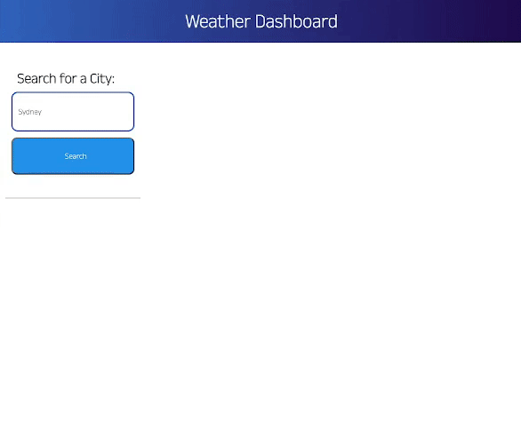
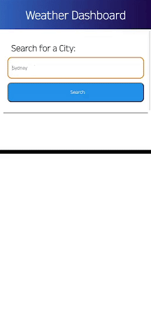

# Dan-Smith-06-Weather-Dashboard-Sever-APIs

**Description**

This weather dashboard application allows users to type in a city name and retreive detailed information about the current 
weather and future forcasts based on their city input.

When the user enters a valid city name, the information will render on screen and their search will be added to the previous searches section

A special feature in the application is the UV index section. You will notice that the UV index is conditionally formatted to warn the user
about potentially extreme radiation levels. The formatting starts with green at the lowest UV levels and approaches red the more extreme the 
levels are. It is based on the below link
https://www.cancer.org.au/cancer-information/causes-and-prevention/sun-safety/uv-index

Made using:

- HTML
- CSS
- JavaScript
- Moment.js
- Openweather API

**Website Gif Example**

The application is also responsive to smaller screen sizes

**Mockup Website Link**

Website link:
https://dansmith09.github.io/Dan-Smith-06-Weather-Dashboard-Sever-APIs/
